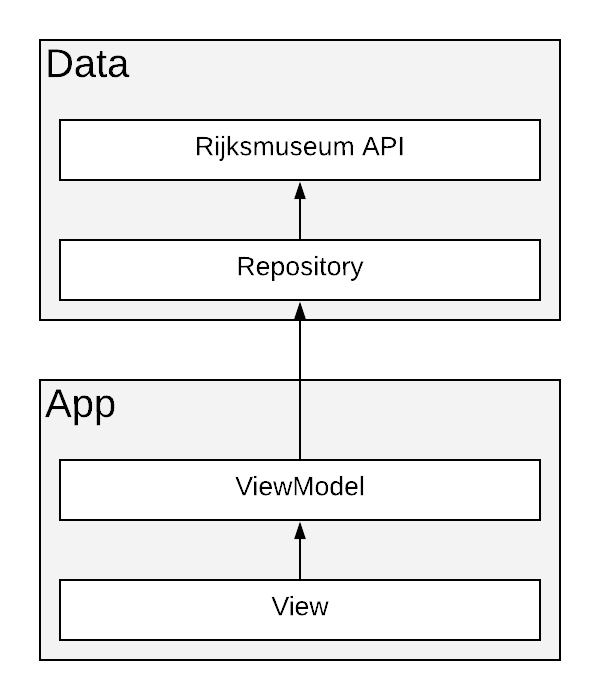
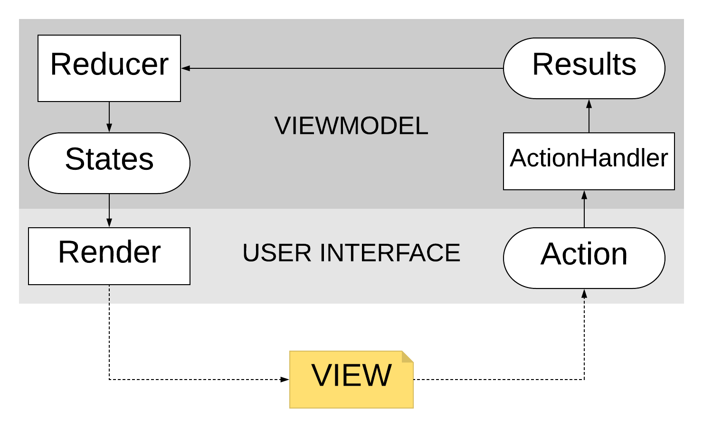

# Rijksmuseum

[Rijksmuseum API](http://rijksmuseum.github.io/) client

### Building the app
1. Get an API Key from the [Rijksmuseum API page](https://www.rijksmuseum.nl/en/api)
2. Add API Key into `local.properties` with `apiKey` as the variable name.
    ```
    apiKey="<API_KEY>"
    ```
3. Build the app

## Architecture


The app uses a combination of the `repository pattern` and `MVI (Model-View-Intent)` to keep the code clean, readable, and maintainable.

* **Repository Pattern** - to have a clear separation between the `UI` and the `Data` layer
* **MVI (Model-View-Intent)** - Reactive way in managing UI states. Decouples the UI logic from the UI rendering to keep the views passive. It is also easier to test since we only need to test the `action` and it should return a `state`.
* Uses **[Kaskade](https://github.com/gumil/Kaskade)** to simplify the MVI Pattern
* **Offline Mode** -  uses `OkHttp cache`. Caches responses and uses them when network is not available

### Diagram


* **State** - Model that represents the ouput
* **Action** - Model that represents the input
* **Result** - Reduces action and state to a new state. Paired with an action to determine new state.

Side effects should only happen when:
 1. a user executes an `Action`
 2. `ActionHandler` - usually get the data from repository
 3. `Render` - updates the UI from the emitted state